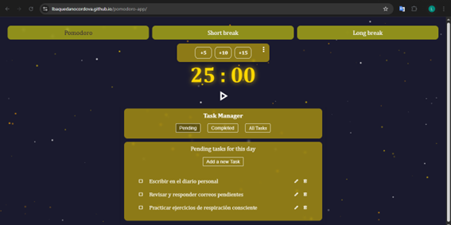

# ⏱️ Pomodoro App

App Pomodoro sencilla y efectiva para gestionar tareas y mantener el enfoque. Ideal para quienes siguen la técnica Pomodoro.


## Demo en vivo

👉 [https://LBaquedanoCordova.github.io/pomodoro-app/](https://LBaquedanoCordova.github.io/pomodoro-app/)

## Vista previa



## Tecnologías utilizadas

- [Vite](https://vitejs.dev/) — Bundler
- Vanilla JavaScript (modular, con imports/exports)
- HTML5 y CSS3
- API Web Audio para reproducción de sonidos
- Interfaz interactiva con gestión de tareas

## Funcionalidades

- Iniciar, pausar y reiniciar el temporizador
- Modos de trabajo, descanso corto y largo
- Reproducción de sonido al finalizar cada sesión
- Agregar, editar, completar y eliminar tareas
- Filtrado de tareas por estado y fecha
- Guardado de datos en `localStorage` para persistencia
- Diseño responsive adaptado a dispositivos móviles

## Instalación local

```bash
git clone https://github.com/LBaquedanoCordova/pomodoro-app.git
cd pomodoro-app
npm install
npm run dev
```
## Estructura del proyecto

```bash
pomodoro-app/
├── public/           # Archivos estáticos (sonidos, screenshot, etc.)
├── src/
│   ├── js/           # Módulos de funcionalidad
│   └── main.js       # Punto de entrada
├── index.html
└── vite.config.js
```

## Autor

**Luis Baquedano Córdova**  
[GitHub](https://github.com/LBaquedanoCordova)